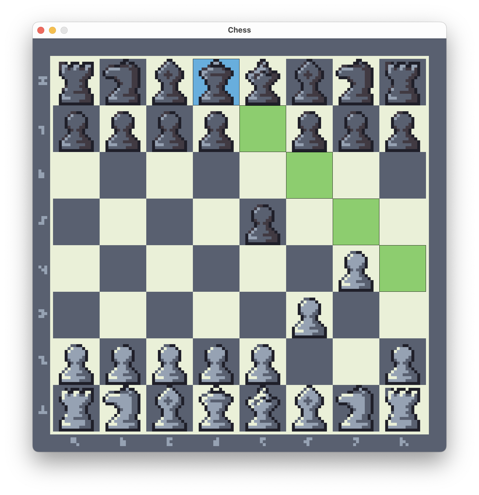

# Chess

[](README.md)
[](README.fr.md)

You can find here the project for the "Object Oriented Programming 2" class. The project paper, the report and the UML diagrammes can be found under `extras/`.

It consists of a simple (multiplayer only) Chess game made entirely in Java from scratch with a [JavaFX](https://openjfx.io/) graphical interface.



## Students

**Efe ERKEN**

Year: 2nd year 4th semester Spring 2023

Groups: TD2-TP4

## Problems encountered

Here, you can find the problems I had during development and how I solved them (or not).

### Game grid

To model the game board, I created a container representing each square that can contain a piece or not
as well as other information like the danger of the square and the selection status (when the player selects a square to play a piece and see the squares to which it can move). I created a two dimensional array of these squares to represent the game grid.

### The pieces

For the pieces, I created an abstract class, but at a certain point, I had to separate the royal pieces et and the normal pieces since only a normal piece can put a royal piece in check. I had to again extend this abstract class with other abstract classes to further specify the piece type and its capacity rather than having empty method overrides.

### The movement of the pieces

I had to invent a danger calculation system for each square to avoid illegal moves by the king. But also
a legal coordinate calculation system for other pieces in case of a check to only allow legal moves
(moves that save the king only). For this, I added many methods and I structured the move calculations for each piece to a suite of checks which are used by a method which traverses all the possible moves
for each piece which are then filtered again if there is a case of check or danger. They are finally added
to the list of possible coordinates for the piece. Each piece checks if its destination coordinates are inside the grid, are well in its movement pattern as well as other additional checks like checking if there are no other piece between itself and its destination for the pieces which are not leapers and and some checks for the special moves that piece can have ("en passant" for the pawn for exemple).

### The game loop

I made it so that the pieces of the opposite color to that which will move, calculate their moves first
to determine the danger before before the calculation of the opposite color, which needs this information to find true possible moves.

The `Game` class is the central point of the game logic. It manages the loop by ensuring the move calculations, their execution, advancing of turns, the history of moves and the deciding of the end of the game.

### Graphical interface

I used JavaFX and FXML for the graphical interface. I used a `GridPane` of 8 columns and 8 rows along with
`StackPane`s in each square which contain themselves images and rectangles to display the pieces and the color of squares in case they are selected.

Later on, I also added buttons (annuler (undo), refaire (redo), recommencer (restart)) and alerts (what to do at the end of the game) for more interaction with the user.

## JDK versions

I used the following Java JDK binaries: Oracle OpenJDK, Oracle JDK et Eclipse Temurin OpenJDK by Adoptium.

I paid attention to test my program on the faculty's machines to check for errors before submitting on Moodle.

Below are the JDK versions that I used the most during development on my personal machine and at the faculty.

```text
openjdk 17.0.7 2023-04-18
OpenJDK Runtime Environment Homebrew (build 17.0.7+0)
OpenJDK 64-Bit Server VM Homebrew (build 17.0.7+0, mixed mode, sharing)

openjdk 11.0.19 2023-04-18
OpenJDK Runtime Environment Homebrew (build 11.0.19+0)
OpenJDK 64-Bit Server VM Homebrew (build 11.0.19+0, mixed mode)

openjdk 11.0.18 2023-01-17
OpenJDK Runtime Environment (build 11.0.18+10-post-Ubuntu-0ubuntu120.04.1)
OpenJDK 64-Bit Server VM (build 11.0.18+10-post-Ubuntu-0ubuntu120.04.1, mixed mode, sharing)
```

The game is ensured working with **Java 17** and I highly recommend it to you (I tested thoroughly with this version).

## Usage

### How to compile and execute?

First, to compile, install at least a **version 17** Java JDK.

Then, download the project on your machine with `git clone` or by downloading the archive of the project.

Once that's done, go to the project's directory and compile. The compiled files are found under
`build/` and the unique `.jar` file under `build/libs/`. If it's your first time compiling, it could take a bit of time. **Attention** if you're on Windows, use `gradlew.bat` instead of `./gradlew`.

```sh
cd chess/

./gradlew build
```

Henceforth, you can execute the game as long as you are in its directory. Or normally, you can
double click on the `.jar` suffixed `-all` (or the `java -jar <*.jar>` command) depending on if you're Java installation is correct (environment variable for the correct version of Java configured (`JAVA_HOME`) as well as the default application to launch the `.jar` files).

```sh
./gradlew run
```

### Generating the documentation

To generate the documentation for your copy of the program, use the following command and take a look at the `build/docs/javadoc/index.html` file in your favorite web browser.

```sh
./gradlew javadoc
```

### Run the tests

To run the unit tests, run this command:

```sh
./gradlew test
```

### How to clean?

To clean the project directory to start from zero:

Delete the compilation files, the final executable and the documentation (`build/*`).

```sh
./gradlew clean
```

## Git repository

The git repository of [this project](https://greengageplum.github.io/sokoban/) follows a clear and determined
structure put forth by Vincent Driessen in his
post "[A successful Git branching model](https://nvie.com/posts/a-successful-git-branching-model/)".

So don't be surprised by the fact that the `main branch` has few commits. All the development is happening on
the `develop branch`. Before each version, everything is prepared and guaranteed functional to be merged
into `main branch` which only has stable and complete versions.

### Emoji legend

These are the meanings of the emojis used in the git commit messages. See [gitmoji](https://gitmoji.dev/) also.

| Emoji       | Signification                                      |
|:------------|:---------------------------------------------------|
| ✨ NEW      | New file or feature                                |
| 🔧 UPDATE   | Update of a part of the program                    |
| 🔨 CONFIG   | Changes in config files like makefile and doxyfile |
| ♻️  REFACTOR | Rewrite of a part of the program                   |
| 🐛 BUGFIX   | A bug fix                                          |
| 🔥 DELETION | Removal of a file or a feature                     |
| 📝 DOC      | Changes in the documentation                       |
| 🎉 EPOCH    | The beginning of the project                       |
| 🚀 RELEASE  | A new version of the program                       |
